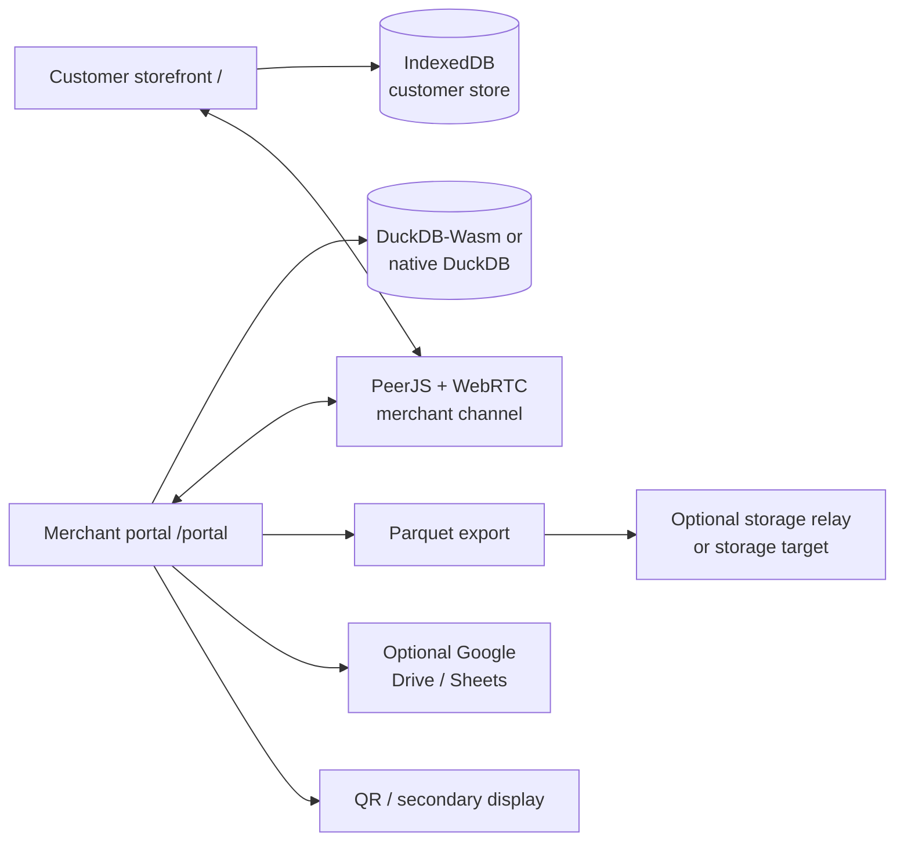

# OFFLINE-FIRST CUSTOMER ORDERING AND ENTERPRISE RESOURCE MANAGEMENT SYSTEM

## Abstract

An offline-first commerce and enterprise resource management system is disclosed. The system comprises a customer ordering client, a merchant operations client, and an optional secondary-display client, all implemented from a shared Flutter codebase. The customer ordering client maintains a local product and order store and communicates with the merchant operations client through a store-specific peer channel. The merchant operations client maintains a relational database in a browser or device runtime, performs order ingestion, inventory operations, point-of-sale settlement, customer management, booking, loyalty, content, and access-control operations locally, and optionally exports selected data to a pluggable storage target. Customer order contents may be encrypted using a wallet-derived key. The system thereby permits a store to conduct core ordering and operational workflows without requiring a conventional application server to execute relational business logic.

## 1. Title

**Offline-First Customer Ordering and Enterprise Resource Management System**

## 2. Technical Field

The present disclosure relates to computer-implemented point-of-sale, customer ordering, inventory, booking, loyalty, and enterprise resource management systems. More particularly, it relates to an offline-first system in which relational data processing and business workflows execute in a browser or local device runtime, while peer communication and optional storage synchronization are separated from the core application logic.

## 3. Prior Art and Technical Context

This section records the technical systems, data models, and implementation patterns that informed the project. The references below describe compatibility targets, architectural influences, or recognizable categories of prior technology; they are not presented as a legal prior-art search or as formal patent citations.

### 3.1 Business application and schema references

The relational model combines selected ideas from established business-software repositories. The reference repositories are full applications or frameworks; this project does not embed those applications or copy their server implementations. It adapts selected data relationships and workflow vocabulary to a local DuckDB model.

| Reference repository | How the reference project works | Specific adaptation in this project |
| --- | --- | --- |
| [Dolibarr](https://github.com/Dolibarr/dolibarr) | A modular PHP web ERP/CRM application. Its business modules organize third parties, products, orders, invoices, payments, stock, warehouses, agenda, accounting, and related records around a shared company database. | The `erp` schema uses `llx_*`-style tables and relationships for customers, contacts, products, categories, orders, invoices, payments, warehouses, stock movements, POS cash fences, and settings. It preserves recognizable identifiers such as `rowid`, `fk_soc`, `fk_product`, `fk_statut`, and `fk_entrepot` while executing locally in DuckDB rather than in Dolibarr’s PHP server. |
| [Rocket.Chat](https://github.com/RocketChat/Rocket.Chat) | A real-time communications platform organized around servers, channels/rooms, subscriptions, users, messages, and live message delivery. | The `chat` schema keeps the room/subscription/message relationship but scopes rooms to a store channel and wallet identity. Messages are exchanged through the project’s WebRTC channel and persisted locally instead of requiring a Rocket.Chat server. |
| Headless CMS pattern | A CMS separates structured content management from presentation. Editors manage collections and fields while a client renders content through an API or local data store. | The `cms` schema stores collections, fields, and JSON-like items for storefront title, hero content, menu content, button labels, images, and theme settings. The Flutter storefront renders the content directly from its local snapshot. |
| [Directus](https://github.com/directus/directus) | A database-first open data platform that adds an admin studio, permissions, and generated REST/GraphQL APIs over SQL data. Its collections and fields let non-technical users manage structured content while applications consume that content through APIs. | The system adopts the collection/field/item idea for the local `cms` schema and the portal’s **Site content** editor. Instead of running a Directus API server, the portal writes CMS items directly into DuckDB and syncs the published storefront snapshot to IndexedDB over the merchant channel. |
| Legacy loyalty model | A simple rewards system commonly represents a member account plus a ledger of earned, spent, or adjusted points. | The `loyalty` schema retains `accounts` and `points_transactions` for compatibility with earlier project data. Current membership, booking points, rewards, and claims use the richer `suitecrm` schema. |
| [OpenMES](https://github.com/Mes-Open/OpenMes) | A manufacturing-execution system tracks production resources and operational state, including machines, work activity, workers, scheduling, and downtime. Its purpose is to connect planned work with the real-time state of execution. | The `mes` schema applies that execution model to store and service operations: machines or tables, shelf locations, shelf stock, production/booking orders, workers, shifts, downtime reasons, and downtime history. |
| [Keycloak](https://github.com/keycloak/keycloak) | An identity and access-management server centralizes realms, users, clients, roles, groups, authentication, and authorization for applications and services. | The `iam` schema keeps the realm/user/role/permission vocabulary but makes the wallet address the local user key. Permission checks happen inside the client and filter portal navigation and mutations; no Keycloak server is required. |
| [OpenProject](https://github.com/opf/openproject) | A project-management system organizes work packages, statuses, assignees/participants, and activity or journal history across status transitions. | The `op` schema models service events as work packages with statuses, participants, journals, and state transitions. It is available through the local database layer and is currently not a dedicated portal tab. |
| [SuiteCRM](https://github.com/SuiteCRM/SuiteCRM) | A modular CRM manages accounts, contacts, meetings, products, sales-related records, memberships, and customer workflows through related business modules. | The `suitecrm` schema adapts accounts, contacts, meetings, products, memberships, bookings, points ledgers, rewards, and reward claims to support member benefits and scheduled services alongside the ERP model. |

The specificity of the adaptation is therefore at the schema and workflow level: table families, foreign-key relationships, status concepts, ledgers, and local permission checks are retained where useful; the original repositories’ web servers, APIs, authentication servers, and UI modules are not dependencies of this application.

### 3.2 Runtime, storage, and transport references

The implementation also combines established browser, device, and integration technologies:

- **[Flutter](https://github.com/flutter/flutter) and [Dart](https://github.com/dart-lang/sdk):** Flutter provides the widget/rendering framework and platform build targets, while Dart provides the language and runtime used by `lib/main.dart`, the service adapters, routing, localization, and feature modules.
- **IndexedDB:** provides browser-local object storage for the customer catalog snapshot, encrypted order envelopes, wallet-linked customer records, channels, chat, CMS items, bookings, and member sessions.
- **[DuckDB](https://github.com/duckdb/duckdb) and DuckDB-Wasm:** DuckDB is an embedded SQL/analytics engine that executes in the host process rather than requiring a database server. The web target runs its WebAssembly build in a browser worker; Android links a native build through JNI. In this project it owns local ERP DDL, joins, aggregation, sales analysis, stock calculations, backups, and Parquet export.
- **Web Workers and WebAssembly:** support browser-side database execution without moving the ERP workload to a conventional application server.
- **[PeerJS](https://github.com/peers/peerjs):** PeerJS supplies a browser API and signaling-assisted peer discovery on top of WebRTC. The system uses a deterministic merchant peer ID derived from the store channel, allowing a customer URL to find the merchant portal without a project-specific order server.
- **[WebRTC native source](https://webrtc.googlesource.com/src/):** WebRTC provides peer connections, ICE negotiation, data channels, and media transport between browser or native endpoints. In the system, the browser data channel carries order, CMS, chat, loyalty, and service messages directly between customer and merchant; Android initializes a native `PeerConnectionFactory` for device-native peer capabilities.
- **[BitTorrent protocol and BEPs](https://github.com/bittorrent/bittorrent.org):** BitTorrent divides content into pieces, exchanges piece availability between peers, transfers pieces independently, and verifies reconstructed content using hashes. The system does not implement a public torrent swarm or tracker; its Android `PieceExchangeEngine` adapts the piece-oriented model for controlled peer-to-peer binary content exchange, progress reporting, and integrity checks for assets such as second-display content.
- **Android `MethodChannel`, JNI, and `DisplayManager`:** bridge Flutter to native DuckDB, WebRTC initialization, piece exchange, and compatible secondary displays.
- **[EIP-1193](https://eips.ethereum.org/EIPS/eip-1193) wallet-provider model:** EIP-1193 defines the common JavaScript provider interface used by browser wallets to expose accounts, chain information, and request methods to a web application. The system uses the injected provider through `flutter_web3` for merchant or customer wallet connection; it uses the wallet address as a portable identity key rather than requiring a conventional username/password account.
- **[ethers.js](https://github.com/ethers-io/ethers.js) local wallet model:** ethers.js provides EVM wallet creation, recovery-phrase restoration, signing, and encrypted JSON keystore support. The system uses this model in `web/local_wallet_bridge.js` to generate or restore a local wallet, persist only an encrypted keystore, and keep the decrypted private key inside the browser bridge during unlock and encryption operations.
- **Wallet-derived application encryption:** AES-GCM protects customer order payloads in browser storage. The active wallet identity is used to derive the application key, so the encrypted order envelope is associated with its owner while channel and wallet fields remain available for local filtering.
- **[W3C WebAuthn](https://github.com/w3c/webauthn) and FIDO2/passkeys:** WebAuthn uses a challenge and an authenticator-held public/private key pair to prove control of a credential without sending the private key to the website. The system uses the browser’s WebAuthn/PRF capability in `web/passkey_bridge.js` as a local unlock factor: a passkey-derived secret unlocks the encrypted local-wallet passphrase, which then unlocks the ethers.js keystore. The passkey is therefore an unlock mechanism for the local wallet, not a replacement for the wallet address or a remote identity server.
- **Parquet:** provides a compact, portable export artifact for the selected order hand-off view.
- **[FastAPI](https://github.com/fastapi/fastapi) and HTTP:** FastAPI is a Python framework used here only to implement `mock_server/main.py`, a small reference device relay. That relay exposes health checking, HMAC device attestation, and bounded binary upload; it stores the Parquet artifact and does not execute ERP SQL, host the Flutter app, or replace the local DuckDB runtime.
- **Firebase Hosting and static SPA deployment:** host the compiled Flutter web client with client-side route rewrites. Other static hosting platforms can provide the same deployment role.
- **Google Identity Services, Drive, and Sheets APIs:** provide optional OAuth-authorized backup, restore, spreadsheet export, and spreadsheet import.
- **Browser notifications, printing, QR codes, and local browser storage:** provide terminal alerts, channel provisioning, printed customer entry points, and local configuration persistence.

### 3.3 Problem addressed by the combination

Each of the above technologies or schemas addresses a known part of the business problem, but conventional deployments commonly separate them across hosted ERP, POS, CMS, CRM, identity, chat, booking, and manufacturing services. That separation can require multiple servers, duplicate customer and catalog records, and a continuously reachable network path.

The present project combines the selected capabilities in a local client while keeping the boundaries explicit: customer-side IndexedDB, merchant-side DuckDB, direct WebRTC order transfer, wallet-scoped protection, local role enforcement, and optional export to external storage. The storage relay, Google integrations, and signaling infrastructure are therefore supporting components rather than the owners of the merchant’s relational business logic.

## 4. Summary of the Disclosure

In one embodiment, the system includes:

1. A customer storefront at `/` that displays a channel-specific catalog, accepts cart selections and bookings, and submits orders.
2. A merchant portal at `/portal` that initializes a local relational database and provides catalog, order, register, inventory, booking, loyalty, content, reporting, and administration functions.
3. A channel service that associates a merchant with a shareable URL and QR code and establishes a PeerJS/WebRTC connection between the storefront and portal.
4. A local customer data store implemented using IndexedDB.
5. A local merchant data store implemented using DuckDB-Wasm in a browser or native DuckDB on Android.
6. A wallet and credential layer supporting an injected EIP-1193 wallet, a locally generated EVM wallet, and passkey-assisted local-wallet unlock.
7. A pluggable storage synchronization interface that exports selected order data as Parquet and optionally uploads the export to an authenticated storage relay.
8. Optional backup, notification, printing, Google Workspace, QR, secondary-display, and Android-native integrations.

The system separates the transaction path from the optional synchronization path. A store can therefore use the storefront, portal, local database, and peer channel without operating an ERP application server. When a storage target is available, the portal can attest the target, export a selected relational view, and upload the resulting binary artifact.

## 5. Brief Description of the Drawings

### Figure 1 — System topology



### Figure 2 — Customer-to-merchant order flow

```text
channel URL / QR
      ↓
local catalog → cart → optional wallet profile → encrypted order envelope
      ↓
PeerJS/WebRTC merchant channel
      ↓
portal order ingestion → local relational upsert → status / fulfillment / payment
      ↓
optional Parquet export → authenticated storage target
```

### Figure 3 — Local data boundary

```text
Customer device                         Merchant device
----------------                         ---------------
IndexedDB                                 DuckDB-Wasm / native DuckDB
catalog · orders · chat                    ERP · POS · inventory · IAM
CMS · bookings · session       ←WebRTC→    loyalty · bookings · reports
```

## 6. Detailed Description

### 6.1 Application surfaces and actors

The system supports at least two classes of users:

- **Customer:** accesses the storefront, browses products, selects variations, submits orders, communicates with staff, and may participate in bookings or loyalty programs.
- **Merchant operator:** signs into the portal, provisions the store channel, manages catalog and content, receives and fulfills orders, operates a register, manages inventory, administers staff permissions, and performs reporting or backup.

An Android terminal may additionally act as a native database host, a WebRTC endpoint, a piece-exchange endpoint, or a controller for a compatible secondary display.

### 6.2 Store provisioning and channel creation

Upon portal entry, the merchant may authenticate with an injected wallet, unlock a locally stored wallet, unlock through a passkey, or enter a demo mode. The portal initializes the local database, creates or identifies the merchant record, and generates a channel code. The channel code is used to derive a merchant peer identifier and to construct a customer URL of the form:

```text
https://<host>/?channel=<channel-code>
```

The portal can render this URL as a QR code, open a browser print view, invoke thermal printing where supported, or open a second-display route:

```text
https://<host>/?second_display=1&channel=<channel-code>
```

### 6.3 Customer storefront operation

The customer client initializes `dolibarr_client_db`, an IndexedDB database containing a local catalog snapshot and customer-side records. The storefront renders product categories, names, descriptions, prices, images, variations, site content, and theme selections. Product translations and interface labels may be selected according to the active locale.

The customer selects one or more products and submits an order. A wallet-linked profile may include contact data, mobile number, birthday, and wallet identity. Order contents are serialized into an encrypted payload before persistence. The cleartext fields required for local filtering are limited to channel and wallet identifiers.

If the merchant peer is reachable, the customer sends an order envelope over the channel. If the peer is not immediately reachable, customer-side records remain in local storage for subsequent application-level handling. Customer-side booking, chat, CMS, and member-session records are likewise maintained locally.

### 6.4 Merchant order ingestion

The portal polls inbound peer messages and identifies order envelopes. For each received order, the portal may:

1. attest the configured storage device when a device endpoint is available;
2. create or update the customer and contact records;
3. create or update the order header and order lines;
4. update the local relational view;
5. export the selected order view to `dolibarr_orders.parquet`;
6. upload the export to an optional storage target; and
7. notify the operator of the new order.

Order status is represented by the following values:

| Value | Status |
| ---: | --- |
| `0` | Draft |
| `1` | Validated |
| `2` | Accepted |
| `3` | Processing |
| `4` | Delivered |
| `-1` | Canceled |

### 6.5 Local relational processing

The merchant portal uses DuckDB-Wasm in the browser. On Android, the application can initialize a native DuckDB database at `portal.duckdb` through the `lilygo/android_client` method channel and JNI library. Relational joins, aggregation, stock calculations, sales analysis, invoice creation, payment association, status updates, and backup extraction are executed by the local database layer.

The schema is initialized by [`lib/services/database_service.dart`](lib/services/database_service.dart) and the SuiteCRM-compatible portion by [`lib/data/suitecrm_schema.dart`](lib/data/suitecrm_schema.dart).

| Schema | Implemented subject matter |
| --- | --- |
| `erp` | Customers, contacts, products, categories, orders, order lines, invoices, invoice lines, payments, warehouses, stock, stock movements, POS cash fences, payment types, and settings. |
| `chat` | Channel rooms, subscriptions, support rooms, and messages. |
| `cms` | Collections, fields, and storefront content items. |
| `loyalty` | Legacy loyalty tables retained for compatibility. |
| `mes` | Machines, shelf locations, shelf stock, production orders, workers, shifts, downtime reasons, and downtime history. |
| `iam` | Wallet-linked users, roles, permissions, and role mappings. |
| `op` | Service-event/work-package statuses, participants, and journals. |
| `suitecrm` | Memberships, contacts, bookings, points ledger, rewards, and reward claims. |

### 6.6 POS, inventory, and ERP functions

The portal provides the following operational embodiments:

- **Register:** open a cash fence, add products to a register cart, check stock, record cash/card or configured payment methods, close settlement, and issue refunds.
- **Inventory:** receive warehouse stock, transfer stock to shelf locations, adjust shelf quantities, consume shelf stock, and inspect movement history.
- **Catalog:** create or edit products, categories, tax treatment, photos, barcodes, stock thresholds, sale/purchase flags, and localized labels.
- **Sales analysis:** calculate daily, date-range, product, and category aggregates and export sales data as CSV.
- **Bookings and production:** check availability, create or update bookings, maintain machines and workers, schedule shifts, and record downtime.
- **Membership and loyalty:** maintain membership records, award or redeem points, earn points from bookings or purchases, and process reward claims.
- **Access control:** associate wallet identities with built-in or custom roles and permission names such as `orders.manage`, `products.manage`, `register.use`, `bookings.manage`, and `settings.manage`.
- **Content:** maintain CMS items that are copied to the customer-side store and used to render the public storefront.

### 6.7 Peer communication

The browser implementation uses `web/webrtc_bridge.js`. A merchant peer is derived from the channel code using the naming pattern `lilygo-merchant-<channel>`. PeerJS brokers initial discovery and WebRTC carries reliable application messages. Heartbeat messages provide connection liveness and expose connection states including `connecting`, `connected`, `stale`, `open`, and `disconnected`.

The Android implementation initializes a native WebRTC `PeerConnectionFactory`. The Android platform layer also exposes a `PieceExchangeEngine` for piece-oriented binary exchange with progress reporting and a secondary-display presentation path through `DisplayManager`.

### 6.8 Optional storage synchronization

The reference implementation in `mock_server/main.py` represents a LAN or embedded storage target. It does not execute ERP logic. The target provides:

| Interface | Function |
| --- | --- |
| `GET /api/health` | Liveness check. |
| `POST /api/device/attest` | HMAC-SHA256 proof using a device-local key. |
| `PUT /api/storage/sync?filename=...` | Authenticated binary upload to target storage. |

The portal’s `exportParquet()` materializes a selected order view containing order, customer, and contact fields. The complete local database is not implicitly uploaded. The relay supports configured CORS origins, an optional `x-device-sync-token`, upload-size limits, safe filenames, and atomic replacement.

### 6.9 Backup and external integrations

The portal can export and restore a JSON envelope containing local DuckDB and IndexedDB data. When configured with `GOOGLE_OAUTH_CLIENT_ID`, the browser bridge can save or restore a Drive JSON backup and export or import tabular data through Google Sheets. OAuth access tokens are retained in memory by the browser bridge.

Browser notifications, keep-awake behavior, QR scanning, channel printing, and secondary-display opening are optional platform capabilities. Their absence does not prevent local catalog, ordering, or ERP operation.

### 6.10 Authentication, authorization, and data protection

Authentication is a major part of the system architecture rather than an external add-on. The design separates four related concerns:

1. **Identity:** a wallet address identifies a customer or merchant within the local store data model.
2. **Authentication:** an injected wallet, local wallet passphrase, or FIDO/WebAuthn passkey demonstrates control of the local identity.
3. **Authorization:** following the realm/user/role/permission separation used by [Keycloak](https://github.com/keycloak/keycloak), the local `iam` schema maps the authenticated wallet address to roles and permissions that control portal sections and mutations.
4. **Data protection:** wallet-derived AES-GCM keys protect customer order payloads and selected profile data in browser storage.

#### 6.10.1 Supported authentication modes

- **Injected wallet:** a browser wallet exposes an EIP-1193 provider. The application requests the active account through `flutter_web3`, normalizes the wallet address, and uses it to load or create the local customer or merchant record.
- **Local wallet:** the browser bridge creates an EVM wallet using ethers.js, shows the recovery phrase once for backup, and stores only the encrypted JSON keystore in local storage. A passphrase is required to decrypt the keystore.
- **Wallet restoration:** a user can restore the same local identity from a recovery phrase and a new passphrase. The resulting address reconnects the user to wallet-scoped local records where those records are available.
- **FIDO/WebAuthn passkey:** when supported, `web/passkey_bridge.js` enrolls a platform passkey and uses the WebAuthn PRF output as a device-bound unlock factor. The derived secret unlocks the encrypted local-wallet passphrase; it does not expose or replace the private key.
- **Demo mode:** a non-production evaluation path seeds sample data and uses a demo identity. It is intentionally separate from real wallet authentication.

#### 6.10.2 Authentication and order lifecycle

```text
wallet / local keystore / passkey
              ↓
normalized wallet address
              ↓
local customer or merchant profile
              ↓
IAM role and permission lookup
              ↓
wallet-derived encryption key for private local payloads
```

For a customer, the wallet address scopes the customer profile, encrypted order history, chat, and loyalty records. For a merchant, the wallet address identifies the operator, selects the merchant record, establishes the store channel, and determines which portal operations are visible. The wallet address is not itself a permission; permissions come from the local role mapping. Unlike Keycloak, the system does not run a separate realm server, token endpoint, client registry, or external user directory; the relevant authorization records and checks execute locally in DuckDB.

#### 6.10.3 Key and trust boundaries

- The injected provider can identify an account but does not give the application the private key.
- A local wallet private key is decrypted only inside the browser bridge during the operation that needs it; plaintext key material is not returned to Dart or written to IndexedDB.
- The encrypted customer order envelope is stored locally with only channel and wallet fields available for filtering.
- FIDO/WebAuthn protects local-wallet unlock on a supported device. It is not a hosted identity service and does not make the local database remotely recoverable.
- IAM permissions are local application authorization, not a claim that an external identity server has authenticated the operator.
- Device attestation authenticates possession of the storage target’s device key. It does not authenticate the customer or merchant wallet.

This arrangement allows authentication, authorization, and encryption to continue while the application is offline, while keeping optional peer signaling, storage relay, and Google OAuth integrations outside the core identity path.

## 7. Example Operating Procedure

```bash
flutter pub get
flutter config --enable-web
flutter run -d chrome
```

Open `/portal`, select **Demo mode** for an evaluation walkthrough, or authenticate with a wallet. The storefront is available at `/`. A prepared sample catalog can be opened with:

```text
/?demo=1
/?demo=1&simulate=1
```

To run the optional reference storage target:

```bash
python3 -m venv .venv
source .venv/bin/activate
python -m pip install -r mock_server/requirements.txt
python -m uvicorn mock_server.main:app --host 0.0.0.0 --port 8000
```

The client may be pointed to that target with:

```bash
flutter run -d chrome --dart-define=API_URL=http://127.0.0.1:8000
```

For web deployment, `flutter build web --release` produces a static SPA. The host must rewrite `/`, `/portal`, `/second-display`, and other client routes to `index.html`. Firebase Hosting configuration is provided in [`firebase.json`](firebase.json).

## 8. Advantages

The disclosed architecture provides several operational advantages:

1. Core POS and ERP functions remain available without a continuously reachable application server.
2. Customer and merchant clients share a channel-specific workflow without requiring a centralized order API.
3. Relational processing remains in the client runtime, allowing local joins, reporting, and business rules.
4. The storage target is replaceable and receives only an explicit export artifact.
5. Wallet-scoped encryption limits exposure of customer order content in browser storage.
6. The same product concept spans storefront, register, inventory, booking, loyalty, content, and access-control functions.
7. Web, Android, print, QR, secondary-display, and Google Workspace integrations are isolated behind platform bridges.

## 9. Implementation Boundaries

- The system is local-first rather than a centralized multi-tenant ERP service. Cross-device consistency depends on the configured peer and synchronization paths.
- Browser WebRTC connectivity can be affected by signaling availability, NAT, firewalls, and browser network policy.
- An HTTPS-hosted portal calling an HTTP LAN target may be blocked by mixed-content or private-network rules.
- The connection panel retains legacy manual offer/answer controls, while the active browser implementation uses automatic PeerJS channel setup.
- The Android native build is arm64-focused and requires the DuckDB source under `native/duckdb`.
- The `op` service-event model is available in the data layer but does not currently have a dedicated portal navigation panel.

## 10. Technical Feature Summary

The project’s main technical features are:

- **Offline-first local processing:** the customer and merchant clients keep their working data locally, allowing catalog browsing, ordering, POS, inventory, reporting, and administration to continue without a continuously available ERP server.
- **Shared Flutter application:** `/` provides the customer storefront, `/portal` provides the merchant workspace, and `/second-display` provides a standalone channel QR display.
- **Direct store channels:** each store receives a channel code and shareable URL. PeerJS brokers discovery while WebRTC carries customer-to-merchant application messages.
- **Two local data layers:** IndexedDB stores customer-side catalog, orders, chat, CMS items, bookings, and sessions; DuckDB-Wasm or native DuckDB stores the merchant’s relational ERP data.
- **Full local ERP model:** the database covers customers, products, categories, orders, invoices, payments, warehouses, shelf stock, POS cash fences, bookings, loyalty, content, roles, permissions, machines, workers, shifts, and downtime.
- **Wallet-linked identity:** users can connect an injected EIP-1193 wallet, create or restore a browser wallet, or unlock a local wallet with a passphrase or supported WebAuthn passkey.
- **Encrypted customer orders:** order payloads are protected with AES-GCM using a wallet-derived key, while only the fields needed for local filtering remain available in cleartext.
- **Optional storage hand-off:** the portal exports a selected order view as Parquet and can upload it through an authenticated HTTP interface to a LAN relay, embedded storage device, or another compatible target.
- **Device and platform integrations:** QR provisioning, browser or thermal printing, notifications, keep-awake behavior, JSON backup/restore, Google Drive and Sheets integration, Android-native DuckDB, WebRTC, piece exchange, and secondary-display support.
- **Permission-aware operations:** wallet-linked roles control which portal sections and mutations are available to each operator.

Together, these features provide a single local-first workflow from customer discovery and ordering through merchant fulfillment, payment, inventory, loyalty, booking, reporting, and optional backup.

## 11. License

This project is licensed under the [GNU General Public License v3.0](LICENSE).
