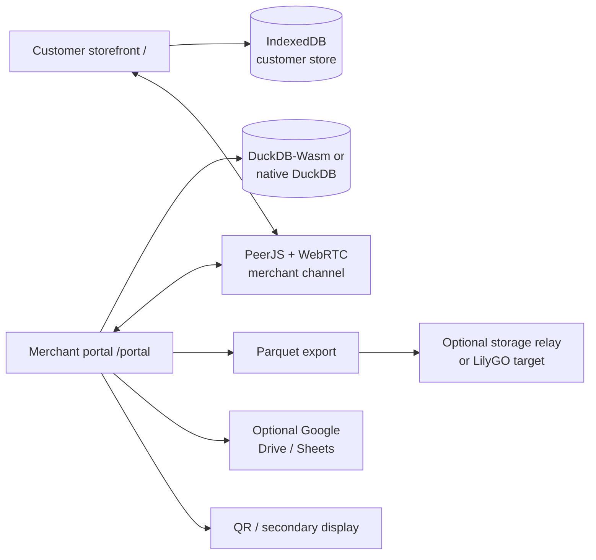

# LILYGO ERP: OFFLINE-FIRST POINT-OF-SALE, CUSTOMER ORDERING, AND ENTERPRISE RESOURCE MANAGEMENT SYSTEM

## Abstract

An offline-first commerce and enterprise resource management system is disclosed. The system comprises a customer ordering client, a merchant operations client, and an optional secondary-display client, all implemented from a shared Flutter codebase. The customer ordering client maintains a local product and order store and communicates with the merchant operations client through a store-specific peer channel. The merchant operations client maintains a relational database in a browser or device runtime, performs order ingestion, inventory operations, point-of-sale settlement, customer management, booking, loyalty, content, and access-control operations locally, and optionally exports selected data to a pluggable storage target. Customer order contents may be encrypted using a wallet-derived key. The system thereby permits a store to conduct core ordering and operational workflows without requiring a conventional application server to execute relational business logic.

## 1. Title

**LILYGO ERP: Offline-First Point-of-Sale, Customer Ordering, and Enterprise Resource Management System**

## 2. Technical Field

The present disclosure relates to computer-implemented point-of-sale, customer ordering, inventory, booking, loyalty, and enterprise resource management systems. More particularly, it relates to an offline-first system in which relational data processing and business workflows execute in a browser or local device runtime, while peer communication and optional storage synchronization are separated from the core application logic.

## 3. Background

Conventional point-of-sale and enterprise systems commonly depend on a continuously reachable application server. Such dependence can make a store unable to browse a catalog, accept orders, operate a register, or inspect inventory during a network outage. It can also require a business to provision and maintain a server even when the desired deployment consists of a small number of local terminals.

Customer ordering systems and merchant back-office systems are also frequently implemented as separate applications with separate data models. This can result in duplicated catalog configuration, delayed order hand-off, and limited support for direct device-to-device operation. Cloud-only persistence can further expose customer information and operational records to infrastructure that is not necessary for the immediate transaction.

Accordingly, a system is needed that provides a unified customer and merchant workflow, local relational processing, direct peer order delivery, optional durable synchronization, and wallet-scoped identity and data protection.

## 4. Summary of the Disclosure

In one embodiment, the system includes:

1. A customer storefront at `/` that displays a channel-specific catalog, accepts cart selections and bookings, and submits orders.
2. A merchant portal at `/portal` that initializes a local relational database and provides catalog, order, register, inventory, booking, loyalty, content, reporting, and administration functions.
3. A channel service that associates a merchant with a shareable URL and QR code and establishes a PeerJS/WebRTC connection between the storefront and portal.
4. A local customer data store implemented using IndexedDB.
5. A local merchant data store implemented using DuckDB-Wasm in a browser or native DuckDB on Android.
6. A wallet and credential layer supporting an injected EIP-1193 wallet, a locally generated EVM wallet, and passkey-assisted local-wallet unlock.
7. A pluggable storage synchronization interface that exports selected order data as Parquet and optionally uploads the export to an authenticated storage relay.
8. Optional backup, notification, printing, Google Workspace, QR, secondary-display, and Android-native integrations.

The system separates the transaction path from the optional synchronization path. A store can therefore use the storefront, portal, local database, and peer channel without operating an ERP application server. When a storage target is available, the portal can attest the target, export a selected relational view, and upload the resulting binary artifact.

## 5. Brief Description of the Drawings

### Figure 1 — System topology



### Figure 2 — Customer-to-merchant order flow

```text
channel URL / QR
      ↓
local catalog → cart → optional wallet profile → encrypted order envelope
      ↓
PeerJS/WebRTC merchant channel
      ↓
portal order ingestion → local relational upsert → status / fulfillment / payment
      ↓
optional Parquet export → authenticated storage target
```

### Figure 3 — Local data boundary

```text
Customer device                         Merchant device
----------------                         ---------------
IndexedDB                                 DuckDB-Wasm / native DuckDB
catalog · orders · chat                    ERP · POS · inventory · IAM
CMS · bookings · session       ←WebRTC→    loyalty · bookings · reports
```

## 6. Detailed Description

### 6.1 Application surfaces and actors

The system supports at least two classes of users:

- **Customer:** accesses the storefront, browses products, selects variations, submits orders, communicates with staff, and may participate in bookings or loyalty programs.
- **Merchant operator:** signs into the portal, provisions the store channel, manages catalog and content, receives and fulfills orders, operates a register, manages inventory, administers staff permissions, and performs reporting or backup.

An Android terminal may additionally act as a native database host, a WebRTC endpoint, a piece-exchange endpoint, or a controller for a compatible secondary display.

### 6.2 Store provisioning and channel creation

Upon portal entry, the merchant may authenticate with an injected wallet, unlock a locally stored wallet, unlock through a passkey, or enter a demo mode. The portal initializes the local database, creates or identifies the merchant record, and generates a channel code. The channel code is used to derive a merchant peer identifier and to construct a customer URL of the form:

```text
https://<host>/?channel=<channel-code>
```

The portal can render this URL as a QR code, open a browser print view, invoke thermal printing where supported, or open a second-display route:

```text
https://<host>/?second_display=1&channel=<channel-code>
```

### 6.3 Customer storefront operation

The customer client initializes `dolibarr_client_db`, an IndexedDB database containing a local catalog snapshot and customer-side records. The storefront renders product categories, names, descriptions, prices, images, variations, site content, and theme selections. Product translations and interface labels may be selected according to the active locale.

The customer selects one or more products and submits an order. A wallet-linked profile may include contact data, mobile number, birthday, and wallet identity. Order contents are serialized into an encrypted payload before persistence. The cleartext fields required for local filtering are limited to channel and wallet identifiers.

If the merchant peer is reachable, the customer sends an order envelope over the channel. If the peer is not immediately reachable, customer-side records remain in local storage for subsequent application-level handling. Customer-side booking, chat, CMS, and member-session records are likewise maintained locally.

### 6.4 Merchant order ingestion

The portal polls inbound peer messages and identifies order envelopes. For each received order, the portal may:

1. attest the configured storage device when a device endpoint is available;
2. create or update the customer and contact records;
3. create or update the order header and order lines;
4. update the local relational view;
5. export the selected order view to `dolibarr_orders.parquet`;
6. upload the export to an optional storage target; and
7. notify the operator of the new order.

Order status is represented by the following values:

| Value | Status |
| ---: | --- |
| `0` | Draft |
| `1` | Validated |
| `2` | Accepted |
| `3` | Processing |
| `4` | Delivered |
| `-1` | Canceled |

### 6.5 Local relational processing

The merchant portal uses DuckDB-Wasm in the browser. On Android, the application can initialize a native DuckDB database at `portal.duckdb` through the `lilygo/android_client` method channel and JNI library. Relational joins, aggregation, stock calculations, sales analysis, invoice creation, payment association, status updates, and backup extraction are executed by the local database layer.

The schema is initialized by [`lib/services/database_service.dart`](lib/services/database_service.dart) and the SuiteCRM-compatible portion by [`lib/data/suitecrm_schema.dart`](lib/data/suitecrm_schema.dart).

| Schema | Implemented subject matter |
| --- | --- |
| `erp` | Customers, contacts, products, categories, orders, order lines, invoices, invoice lines, payments, warehouses, stock, stock movements, POS cash fences, payment types, and settings. |
| `chat` | Channel rooms, subscriptions, support rooms, and messages. |
| `cms` | Collections, fields, and storefront content items. |
| `loyalty` | Legacy loyalty tables retained for compatibility. |
| `mes` | Machines, shelf locations, shelf stock, production orders, workers, shifts, downtime reasons, and downtime history. |
| `iam` | Wallet-linked users, roles, permissions, and role mappings. |
| `op` | Service-event/work-package statuses, participants, and journals. |
| `suitecrm` | Memberships, contacts, bookings, points ledger, rewards, and reward claims. |

### 6.6 POS, inventory, and ERP functions

The portal provides the following operational embodiments:

- **Register:** open a cash fence, add products to a register cart, check stock, record cash/card or configured payment methods, close settlement, and issue refunds.
- **Inventory:** receive warehouse stock, transfer stock to shelf locations, adjust shelf quantities, consume shelf stock, and inspect movement history.
- **Catalog:** create or edit products, categories, tax treatment, photos, barcodes, stock thresholds, sale/purchase flags, and localized labels.
- **Sales analysis:** calculate daily, date-range, product, and category aggregates and export sales data as CSV.
- **Bookings and production:** check availability, create or update bookings, maintain machines and workers, schedule shifts, and record downtime.
- **Membership and loyalty:** maintain membership records, award or redeem points, earn points from bookings or purchases, and process reward claims.
- **Access control:** associate wallet identities with built-in or custom roles and permission names such as `orders.manage`, `products.manage`, `register.use`, `bookings.manage`, and `settings.manage`.
- **Content:** maintain CMS items that are copied to the customer-side store and used to render the public storefront.

### 6.7 Peer communication

The browser implementation uses `web/webrtc_bridge.js`. A merchant peer is derived from the channel code using the naming pattern `lilygo-merchant-<channel>`. PeerJS brokers initial discovery and WebRTC carries reliable application messages. Heartbeat messages provide connection liveness and expose connection states including `connecting`, `connected`, `stale`, `open`, and `disconnected`.

The Android implementation initializes a native WebRTC `PeerConnectionFactory`. The Android platform layer also exposes a `PieceExchangeEngine` for piece-oriented binary exchange with progress reporting and a secondary-display presentation path through `DisplayManager`.

### 6.8 Optional storage synchronization

The reference implementation in `mock_server/main.py` represents a LilyGO or LAN storage target. It does not execute ERP logic. The target provides:

| Interface | Function |
| --- | --- |
| `GET /api/health` | Liveness check. |
| `POST /api/device/attest` | HMAC-SHA256 proof using a device-local key. |
| `PUT /api/storage/sync?filename=...` | Authenticated binary upload to target storage. |

The portal’s `exportParquet()` materializes a selected order view containing order, customer, and contact fields. The complete local database is not implicitly uploaded. The relay supports configured CORS origins, an optional `x-device-sync-token`, upload-size limits, safe filenames, and atomic replacement.

### 6.9 Backup and external integrations

The portal can export and restore a JSON envelope containing local DuckDB and IndexedDB data. When configured with `GOOGLE_OAUTH_CLIENT_ID`, the browser bridge can save or restore a Drive JSON backup and export or import tabular data through Google Sheets. OAuth access tokens are retained in memory by the browser bridge.

Browser notifications, keep-awake behavior, QR scanning, channel printing, and secondary-display opening are optional platform capabilities. Their absence does not prevent local catalog, ordering, or ERP operation.

### 6.10 Identity and data protection

The identity layer supports:

- injected EIP-1193 wallets through `flutter_web3`;
- browser-generated EVM wallets through the local wallet bridge;
- encrypted JSON keystore persistence;
- recovery phrase restoration;
- WebAuthn passkey-assisted unlock; and
- wallet-linked customer and merchant records.

The local wallet private key remains within the browser bridge during the relevant operation. Customer order payloads use AES-GCM encryption with a wallet-derived key. Device attestation proves possession of the storage target’s local key and does not by itself authenticate a merchant or customer.

## 7. Example Operating Procedure

```bash
flutter pub get
flutter config --enable-web
flutter run -d chrome
```

Open `/portal`, select **Demo mode** for an evaluation walkthrough, or authenticate with a wallet. The storefront is available at `/`. A prepared sample catalog can be opened with:

```text
/?demo=1
/?demo=1&simulate=1
```

To run the optional reference storage target:

```bash
python3 -m venv .venv
source .venv/bin/activate
python -m pip install -r mock_server/requirements.txt
python -m uvicorn mock_server.main:app --host 0.0.0.0 --port 8000
```

The client may be pointed to that target with:

```bash
flutter run -d chrome --dart-define=API_URL=http://127.0.0.1:8000
```

For web deployment, `flutter build web --release` produces a static SPA. The host must rewrite `/`, `/portal`, `/second-display`, and other client routes to `index.html`. Firebase Hosting configuration is provided in [`firebase.json`](firebase.json).

## 8. Advantages

The disclosed architecture provides several operational advantages:

1. Core POS and ERP functions remain available without a continuously reachable application server.
2. Customer and merchant clients share a channel-specific workflow without requiring a centralized order API.
3. Relational processing remains in the client runtime, allowing local joins, reporting, and business rules.
4. The storage target is replaceable and receives only an explicit export artifact.
5. Wallet-scoped encryption limits exposure of customer order content in browser storage.
6. The same product concept spans storefront, register, inventory, booking, loyalty, content, and access-control functions.
7. Web, Android, print, QR, secondary-display, and Google Workspace integrations are isolated behind platform bridges.

## 9. Implementation Boundaries

- The system is local-first rather than a centralized multi-tenant ERP service. Cross-device consistency depends on the configured peer and synchronization paths.
- Browser WebRTC connectivity can be affected by signaling availability, NAT, firewalls, and browser network policy.
- An HTTPS-hosted portal calling an HTTP LAN target may be blocked by mixed-content or private-network rules.
- The connection panel retains legacy manual offer/answer controls, while the active browser implementation uses automatic PeerJS channel setup.
- The Android native build is arm64-focused and requires the DuckDB source under `native/duckdb`.
- The `op` service-event model is available in the data layer but does not currently have a dedicated portal navigation panel.

## 10. Technical Feature Summary

The project’s main technical features are:

- **Offline-first local processing:** the customer and merchant clients keep their working data locally, allowing catalog browsing, ordering, POS, inventory, reporting, and administration to continue without a continuously available ERP server.
- **Shared Flutter application:** `/` provides the customer storefront, `/portal` provides the merchant workspace, and `/second-display` provides a standalone channel QR display.
- **Direct store channels:** each store receives a channel code and shareable URL. PeerJS brokers discovery while WebRTC carries customer-to-merchant application messages.
- **Two local data layers:** IndexedDB stores customer-side catalog, orders, chat, CMS items, bookings, and sessions; DuckDB-Wasm or native DuckDB stores the merchant’s relational ERP data.
- **Full local ERP model:** the database covers customers, products, categories, orders, invoices, payments, warehouses, shelf stock, POS cash fences, bookings, loyalty, content, roles, permissions, machines, workers, shifts, and downtime.
- **Wallet-linked identity:** users can connect an injected EIP-1193 wallet, create or restore a browser wallet, or unlock a local wallet with a passphrase or supported WebAuthn passkey.
- **Encrypted customer orders:** order payloads are protected with AES-GCM using a wallet-derived key, while only the fields needed for local filtering remain available in cleartext.
- **Optional storage hand-off:** the portal exports a selected order view as Parquet and can upload it through an authenticated HTTP interface to a LAN relay, LilyGO-style device, or another compatible storage target.
- **Device and platform integrations:** QR provisioning, browser or thermal printing, notifications, keep-awake behavior, JSON backup/restore, Google Drive and Sheets integration, Android-native DuckDB, WebRTC, piece exchange, and secondary-display support.
- **Permission-aware operations:** wallet-linked roles control which portal sections and mutations are available to each operator.

Together, these features provide a single local-first workflow from customer discovery and ordering through merchant fulfillment, payment, inventory, loyalty, booking, reporting, and optional backup.

## 11. License

LilyGO ERP is licensed under the [GNU General Public License v3.0](LICENSE).
